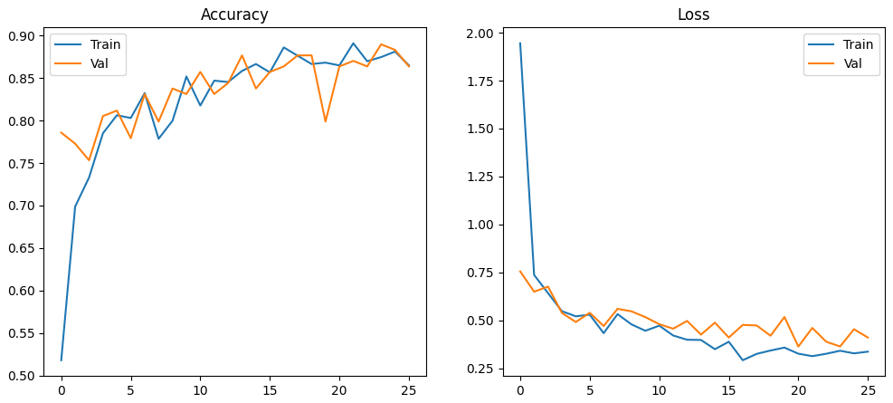
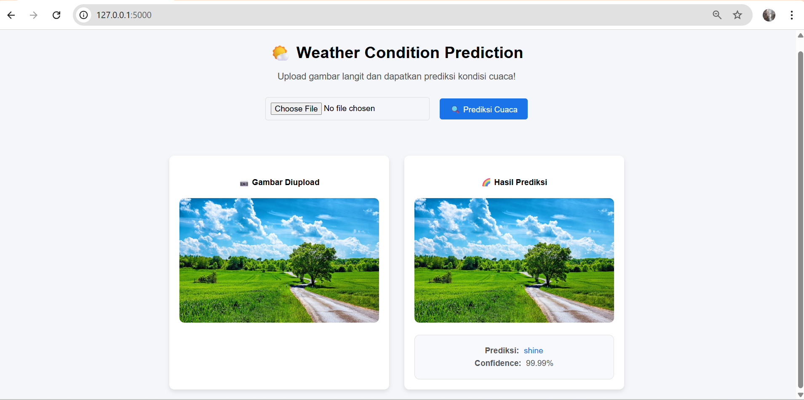

# 🌤️ Prediction of Weather Conditions Based on Screen Images Using CNN

## 🧭 Overview
This project is focused on building a weather prediction system based on sky images using Convolutional Neural Networks (CNN). The model is capable of detecting and classifying weather conditions such as sunny, cloudy, and rainy from static sky images. The system is trained using the "Weather Recognizer with CNN" dataset from Kaggle.

## 📚 Table of Contents
- [Overview](#overview)
- [Dataset](#dataset-)
- [CNN Architecture](#cnn-architecture-)
- [Model Training](#model-training-)
- [Evaluation Model](#evaluation-model-)
- [Results](#results-)
- [Deployment](#deployment-)
  - [Save Model](#save-model-)
  - [Flask Application](#flask-application-)
  - [Flask Application Workflow](#flask-application-workflow-)
  - [Website Interface](#website-interface-)
- [Installation](#installation-)
  - [Prerequisites](#prerequisites-)
  - [Steps to Run the Project](#steps-to-run-the-project-)

## 📊 Dataset 
The dataset used in this project is the [Weather Recognizer with CNN dataset](https://www.kaggle.com/datasets/abhay06102003/weather-recognizer-with-cnn) from Kaggle. It consists of sky images classified into three weather conditions:
- 🌞 Shine (253 images)
- ☁️ Clody (300 images)
- 🌧️ Rainy (215 images)

## 🧠 CNN Architecture
- The model consists of multiple layers:
  - **Convolutional Layers (Conv2D)** for feature extraction (edge, texture, and patterns).
  - **MaxPooling Layers (MaxPooling2D)** for dimensionality reduction.
  - **Flatten Layer** to convert 2D features to a 1D vector.
  - **Dense Layers** for classification.
  - **Dropout** layer to prevent overfitting.

## 📈 Model Training 
- Model is trained using the **Adam optimizer** and **categorical cross-entropy loss**.
- Early stopping is used to prevent overfitting during training, with a maximum of 30 epochs.

## 🧪 Evaluation Model
- The model's performance is evaluated using accuracy, and loss.

## 🎯 Results 
- **Training Accuracy:** 90.39% with a loss of 0.2450.
- **Validation Accuracy:**  86.36% with a loss of 0.3636.

    

## 🚀 Deployment
### 💾 Save Model
The trained model is saved using the command model.save('weather_model.h5') to allow for reuse without retraining. The model is then downloaded from Google Colab using files.download() for deployment to the web application.

### 🖥️ Flask Application 
Next, a project folder named WEATHER_PROJECT is created, which contains the following files:
- app.py              : The main Flask application file.
- weather_model.h5    : The trained CNN model.
- classes.txt         : A file containing the class labels (sunny, cloudy, and rainy).
- requirements.txt    : A file listing the project dependencies.
- templates/index.html: The main HTML page (frontend).
- static/uploads      : A folder to temporarily store uploaded images.

#### 🔁 Flask Application Workflow
1. **Upload Image:** Users can upload sky images in JPG, JPEG, or PNG format.
2. **Weather Prediction:** The model classifies the image and predicts the weather condition (sunny, cloudy, or rainy).
   - The web interface displays the predicted class and confidence level for the uploaded image.

### 🌐 Website Interface 
Below is the initial interface of the website for uploading sky images to predict weather conditions. This feature is built using Flask and supports JPG, JPEG, and PNG image formats. In this example, the uploaded image was successfully classified as 'shine' with a confidence level of 99.99%.

    

## 🛠️ Installation
### 📌 Prerequisites
- Python 3.10
- TensorFlow
- Flask
- NumPy & Pandas
- Pillow

### ▶️ Steps to Run the Project
1. Clone this repository:
   bash
   git clone https://github.com/wiwinsigall/weather_project.git
2. Navigate to the project folder:
   bash
   cd weather_project
3. Install all dependencies:
   bash
   pip install -r requirements.txt
4. Run the application:
   bash
   python app.py
5. Open your browser and go to http://127.0.0.1:5000 to view the web application.

   
